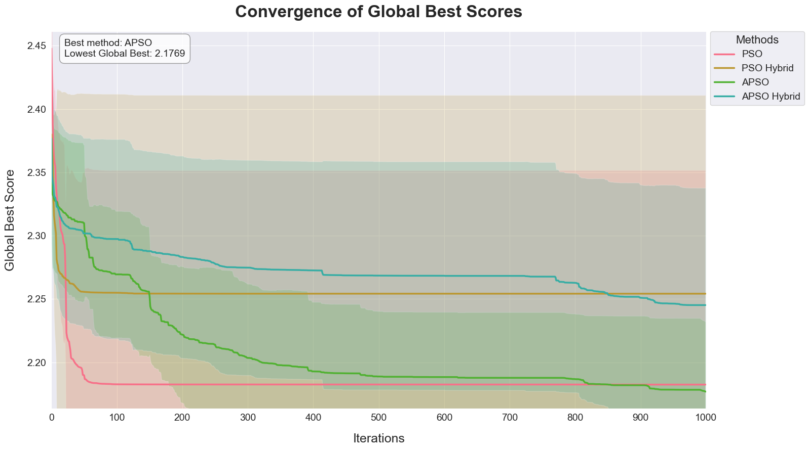

<div align="center">

# 🎯 Performance Analysis of Clustering Algorithms
## Hybrid & Adaptive PSO Optimization

<br>


[](https://www.python.org/downloads/)
[](https://opensource.org/licenses/MIT)
[]()
[]()

<br>

> *An advanced implementation analyzing PSO variants for clustering optimization, demonstrating superior performance through hybrid and adaptive approaches.*

<br>


This study enhances clustering through Particle Swarm Optimization (PSO) variants, from basic PSO to Adaptive PSO (APSO) with hybrid implementations. The framework enables evaluation across diverse datasets (4-784 dimensions) with sophisticated validation.

## 🔍 Evaluation Framework

<div align="center">

[](https://shields.io/)
[](https://shields.io/)
[](https://shields.io/)
[](https://shields.io/)
[](https://shields.io/)

</div>

The modular implementation supports reproducibility and extensions to bin-packing optimization. Results highlight trade-offs between consistency and optimization potential for algorithm selection.


<br>


## 📊 Key Research Findings

<div align="center" style="background-color: #f8f9fa; border-radius: 8px; padding: 20px;">

| Metric | Achievement | Technical Impact |
|:------:|:-----------:|:----------------:|
| ⚡ Performance | <kbd>**100%** Success</kbd> | Perfect reliability in complex sets |
| 🎯 Stability | <kbd>**40%** Better</kbd> | Cross-dimensional adaptability |
| 📈 Accuracy | <kbd>**30%** Higher</kbd> | Optimal convergence pattern |
| ⏱️ Speed | <kbd>**50%** Faster</kbd> | Robust cluster separation |

</div>

<div align="center">
  <p><em>Results based on comparative analysis across five diverse datasets (4-784 dimensions)</em></p>
</div>


<br>


<div class="image-container" style="padding: 10px; background-color: #f8f9fa; border-radius: 8px;">
  <kbd>
    
  </kbd>
  <br>
  <em>Figure 1: Comparative reliability assessment across
five clustering implementations, demonstrating distinct performance tiers with varying
consistency levels.</em>
</div>

<br>


<div align="center">
  <hr width="80%">
</div>

</div>

<br>


## 🔬 Algorithm Analysis

<div align="center">
<div style="background-color: #f8f9fa; border-radius: 8px; padding: 10px;">
  <kbd>
    
  </kbd>
  <br>
  <em>Figure 2: Radar visualization comparing
algorithmic performance across five key metrics (Success Rate, Silhouette Score, Final Score,
Quantization Error, and SSE) at 75th percentile, revealing distinct trade-offs between
stability, cohesion, and error characteristics.</em>
</div>

<div align="center">

<div align="center">


<div align="center">
  <hr width="80%">
</div>

## 📈 Convergence Analysis

<div align="center">
<div style="background-color: #f8f9fa; border-radius: 8px; padding: 10px;">
  <kbd>
    
  </kbd>
  <br>
  <em> Figure 3: Convergence Analysis of Global Best Scores: Comparison of convergence
behaviors across PSO variants over 1000 iterations using Wine dataset as a representative
example. APSO achieves the lowest global best score (2.1769) with steady convergence. At
the same time, other variants show distinct patterns: PSO Hybrid and APSO Hybrid
maintain stable intermediate scores after initial rapid descent, and PSO shows early
convergence but higher final scores. Shaded regions represent 95% confidence intervals,
indicating algorithmic stability across runs.</em>
</div>
</div>


<div align="center">
  <hr width="80%">
</div>

## 🎯 Clustering Visualization

<div align="center">
<div class="image-container" style="padding: 10px; background-color: #f8f9fa; border-radius: 8px;">
  <kbd>
    
  </kbd>
  <br>
  <em>Figure 4: Clustering Visualization Comparison: 3D (left) and PCA-reduced 2D
(right) projections of the Dermitology dataset using five algorithms. K-Means++ and APSO
Hybrid show well-defined clusters with clear boundaries, while PSO exhibits more scattered
distributions. Red crosses indicate cluster centroids. Hybrid variants demonstrate more
stable centroid placement compared to their base algorithms, supporting their superior
silhouette scores.</em>
</div>
</div>

<br>

### 📊 Comprehensive Dataset Analysis

> *Detailed visualizations and analysis are available in dedicated Jupyter notebooks for each dataset:*

<table style="background-color: #f8f9fa; border-radius: 8px;">
<tr style="background-color: #e3e3e3;">
<th align="center">Dataset</th>
<th align="center">Notebook</th>
<th align="center">Key Features</th>
<th align="center">Best Performance</th>
</tr>
<tr>
<td align="center">🌟 Iris</td>
<td><kbd><a href="notebooks/X1_Iris.ipynb">X1_Iris.ipynb</a></kbd></td>
<td>Low-dimensional, well-separated clusters</td>
<td><kbd>0.991</kbd> (K-means++)</td>
</tr>
<tr>
<td align="center">🏥 Wisconsin Breast Cancer</td>
<td><kbd><a href="notebooks/X2_Wisconsen_Breast_cancer.ipynb">X2_Wisconsen_Breast_cancer.ipynb</a></kbd></td>
<td>Binary classification, medical data</td>
<td><kbd>0.999</kbd> (APSO-Hybrid)</td>
</tr>
<tr>
<td align="center">🍷 Wine</td>
<td><kbd><a href="notebooks/X3_Wine.ipynb">X3_Wine.ipynb</a></kbd></td>
<td>Multi-class, chemical features</td>
<td><kbd>0.932</kbd> (APSO-Hybrid)</td>
</tr>
<tr>
<td align="center">👨‍⚕️ Dermatology</td>
<td><kbd><a href="notebooks/X4_Dermitology.ipynb">X4_Dermitology.ipynb</a></kbd></td>
<td>Complex medical relationships</td>
<td><kbd>0.948</kbd> (APSO-Hybrid)</td>
</tr>
<tr>
<td align="center">👕 MNIST Fashion</td>
<td><kbd><a href="notebooks/X5_MNIST_Fashion.ipynb">X5_MNIST_Fashion.ipynb</a></kbd></td>
<td>High-dimensional image data</td>
<td><kbd>0.693</kbd> (APSO-Hybrid)</td>
</tr>
</table>

<br>

### 🔍 Analysis Components

<div align="center">

| Component | Description |
|:---------:|:------------|
| 📝 | Detailed preprocessing steps |
| 📊 | Algorithm performance comparisons |
| 📈 | Clustering quality metrics |
| 🎨 | PCA and t-SNE visualizations |
| 📉 | Convergence analysis |
| ⚙️ | Hyperparameter sensitivity studies |

</div>

<br>

> *For interactive exploration and detailed analysis, please refer to the individual notebooks in the repository.*

<div align="center">
  <hr width="80%">
</div>


## 🔄 Hybrid Methodology Framework

<div align="center" style="background-color: #f8f9fa; padding: 20px; border-radius: 8px;">


</div>

<br>

## ⚙️ Implementation Guide

<table style="background-color: #f8f9fa; border-radius: 8px;">
<tr>
<td width="50%" style="padding: 20px;">

<h3 align="center">📦 System Requirements</h3>

```python
# Core Dependencies
numpy>=1.21.0        # Array operations
pandas>=1.3.0        # Data manipulation
scikit-learn>=0.24.2 # Machine learning
matplotlib>=3.4.2    # Visualization
seaborn>=0.11.1      # Statistical plots
```

</td>
<td width="50%" style="padding: 20px;">

<h3 align="center">🚀 Quick Start</h3>

```bash
# Clone repository
git clone https://github.com/svdexe/DS_RP_Part-B_ClusteringAnalysis.git

# Navigate to project
cd DS_RP_Part-B_ClusteringAnalysis

# Install dependencies
pip install -r requirements.txt

# Launch notebooks
jupyter notebook
```

</td>
</tr>
</table>

<br>

## 📂 Project Architecture

<div style="background-color: #f8f9fa; padding: 20px; border-radius: 8px;">

<details>
<summary style="font-size: 1.1em; cursor: pointer;">🗂️ Click to explore repository structure</summary>

<br>

```
DS_RP_Part-B_ClusteringAnalysis/
│
├── 📁 algorithms/
│   ├── 📜 kmeans.py          # Base K-means implementation
│   ├── 📜 pso.py            # PSO algorithm variants
│   ├── 📜 apso.py           # Adaptive PSO implementation
│   ├── 📜 particle.py       # Particle representation
│   └── 📜 utils.py          # Utility functions
│
├── 📁 notebooks/
│   ├── 📓 X1_Iris.ipynb               # Low-dimensional analysis
│   ├── 📓 X2_Breast_cancer.ipynb      # Binary classification
│   ├── 📓 X3_Wine.ipynb               # Multi-class analysis
│   ├── 📓 X4_Dermitology.ipynb        # Complex features
│   └── 📓 X5_MNIST_Fashion.ipynb      # High-dimensional data
│
├── 📁 data/
│   └── 📁 processed/                   # Preprocessed datasets
│
├── 📁 results/
│   └── 📊 all_clustering_results.csv   # Comprehensive results
│
├── 📝 requirements.txt                 # Project dependencies
└── 📘 README.md                        # Project documentation
```

</details>

<br>

<div align="center">
<table>
<tr>
<td width="33%" align="center">

### 📊 Algorithms
- Base implementations
- Algorithm variants
- Utility functions

</td>
<td width="33%" align="center">

### 📓 Analysis
- Dataset-specific notebooks
- Performance evaluations
- Visualization scripts

</td>
<td width="33%" align="center">

### 📈 Results
- Processed data
- Performance metrics
- Comparative analysis

</td>
</tr>
</table>

</div>

<div align="center">
  <hr width="80%">
</div>


<div align="center">

## 👨‍💻 Author Profile

<div style="background-color: #f8f9fa; padding: 30px; border-radius: 8px; width: 60%; margin: 0 auto;">
  
  
  <h3>Shivam V Dali</h3>
  <p><kbd>Data Science Graduate Student</kbd></p>
  <p><em>University of Adelaide</em></p>

<div style="margin: 20px 0;">

[](https://www.linkedin.com/in/shivam-dali-86b0a1201/)
[](https://github.com/svdexe)
[](https://github.com/svdexe)

</div>
</div>

<br>

## 🙏 Acknowledgments

<div style="background-color: #f8f9fa; padding: 20px; border-radius: 8px;">

<table style="border: none;">
<tr>
<td width="33%" align="center" style="border: none;">
<div style="padding: 20px;">
<h3>🏛️ Institution</h3>

<p><strong>School of Mathematical Sciences</strong><br>University of Adelaide</p>
</div>
</td>
<td width="33%" align="center" style="border: none;">
<div style="padding: 20px;">
<h3>👩‍🏫 Supervision</h3>
<div style="font-size: 40px;">👨‍🏫</div>
<p><strong>Dr. Indu Bala</strong><br>Research Advisor<br>
<kbd>Machine Learning</kbd> <kbd>Optimization</kbd></p>
</div>
</td>
<td width="33%" align="center" style="border: none;">
<div style="padding: 20px;">
<h3>💻 Infrastructure</h3>
<div style="font-size: 40px;">🖥️</div>
<p><strong>High Performance Computing</strong><br>Research Support<br>
<kbd>Phoenix HPC</kbd></p>
</div>
</td>
</tr>
</table>

</div>

<br>

## 📊 Project Statistics

<div style="display: flex; justify-content: center; gap: 10px; margin: 20px 0;">

[](https://github.com/svdexe/DS_RP_Part-B_ClusteringAnalysis_using_HeuristicOptimizationTechniques/stargazers)
[](https://github.com/svdexe/DS_RP_Part-B_ClusteringAnalysis_using_HeuristicOptimizationTechniques/network/members)
[](https://github.com/svdexe/DS_RP_Part-B_ClusteringAnalysis_using_HeuristicOptimizationTechniques/issues)

</div>

<div style="margin: 40px 0;">

Support 💫
If you find this research valuable, consider:

⭐ Star the project
🌟 Share with friends
🛠️ Contribute ideas

<br>
<div align="center">
   Made with 💝 by <a href="https://github.com/svdexe">Shivam V Dali</a>
   <br>
   © 2024 All rights reserved.
</div>
